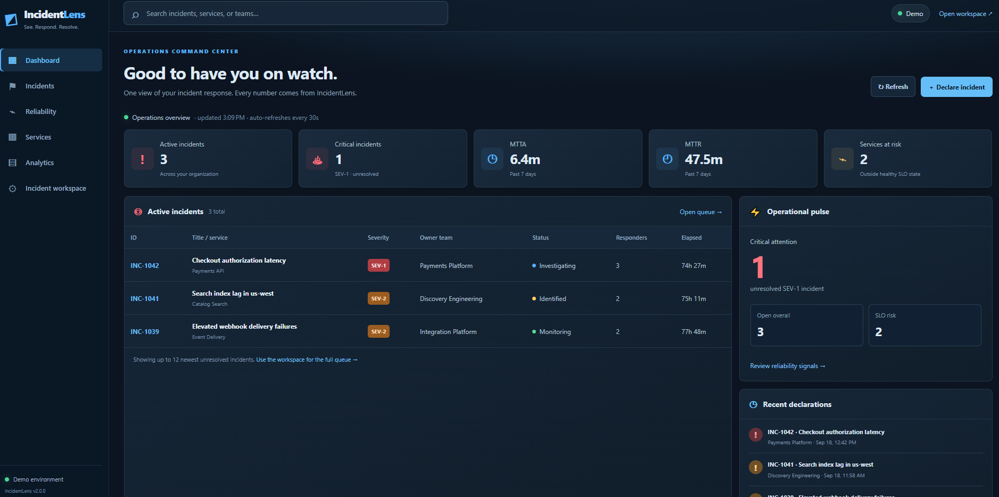

# IncidentLens

**IncidentLens v2.0.1 — Operations Command Center**

IncidentLens is a full-stack, self-hosted incident management platform
for IT operations and engineering teams. It brings active incidents,
service reliability, ownership, response activity, and postmortems
into one operational workspace.

Built with Angular 22, ASP.NET Core 10, and PostgreSQL.

Version 2.0 introduced the Operations Command Center dashboard,
including incident summaries, reliability metrics, active incident
tracking, and a modern dark-themed interface.

Version 2.0.1 is a maintenance release focused on CI validation,
documentation accuracy, and repository cleanup.

## Operations Command Center Preview




## v2.0.1 — CI and Repository Maintenance

### Fixed
- Corrected the deployment test to validate the backend telemetry
  version against the application release version.
- Restored successful deployment validation in GitHub Actions.

### Maintenance
- Excluded generated Python cache files and local debugging logs.
- Removed a committed local debugging log.
- Updated README release information and documentation.

### Application behavior
- No incident-management or dashboard behavior changes.

## What v1.0.0 includes

- Angular 22 standalone components, strict TypeScript, signals, RxJS, reactive forms, and accessible responsive UI
- Paginated server-side filtering across incident ID, title, service, team, owner, tags, severity, and status
- Incident declaration, status transitions, command transfers, responders, tags, and operational notes
- Versioned mutations that return `409 Conflict` and the current record instead of losing another responder's change
- A transport-independent Angular gateway with interchangeable demo and HTTP implementations
- ASP.NET Core 10 minimal APIs with thin endpoints and a testable service layer
- JWT authentication with tenant-aware `Viewer` and `Commander` policies plus required production HTTPS OIDC authority
- PostgreSQL-first production persistence with reviewed EF Core migrations and zero-setup SQLite development
- Append-only audit evidence recording actor, action, details, timestamp, and incident version
- Tenant-scoped authenticated SignalR groups with per-incident operator presence, ownership checks, and reconnect handling
- Transactional outbox records committed beside mutations and dispatched with retry backoff
- Alert ingestion that safely replays the tenant-local incident for duplicate idempotency keys
- Structured timeline commands and extracted mentions
- 30-day MTTA, MTTR, recurrence, customer-impact, availability, SLO-breach, and error-budget analytics
- Seven-day service-health trends correlated with incident impact and reliability objectives
- Versioned postmortems with root cause, detection, resolution, lessons, and owned action items
- Downloadable JSON and CSV evidence packages that combine the incident, audit trail, and postmortem
- OpenTelemetry traces, runtime/HTTP metrics, custom incident counters, and `X-Correlation-ID` propagation
- Version-controlled service objectives with ownership, response targets, error budgets, and fast/slow burn thresholds
- 60-minute and 360-minute SLO burn evaluation with hourly signal deduplication
- Maintenance windows that suppress expected reliability signals while retaining evidence
- Reliability signal acknowledgement and controlled promotion into the existing incident workflow
- Atomic signal promotion that reuses incident audit, timeline, outbox, RBAC, and concurrency behavior
- Health checks, RFC 7807 problem handling, OpenAPI output, cancellation, and async database access
- Human-readable comments focused on design intent instead of narrating syntax
- Angular, API workflow, and tenant-isolation regression suites with cross-stack GitHub Actions validation

- Commander-only tenant-aware retention preview and confirmed, batch-limited cleanup of disposable data
- PostgreSQL backup/verify/restore/drill CLI with SHA-256 manifests and a documented recovery procedure
- Complete Docker Compose and existing-cluster Kubernetes reference deployments, TLS ingress, health probes, and preflight checks
- Configurable tenant-wide read/write and anonymous request admission; health probes remain available under rate limits
- 429/Retry-After behavior, a bounded request body, no-store API responses and strict correlation ID acceptance
- Outbox due-before-batch fairness with delivered/retried telemetry and failure regression tests
- Read-only staging load harness, starting SLO candidates and dependency advisory checks in CI

**v0.9.0 hardening:** Read **[docs/HARDENING.md](docs/HARDENING.md)** for quotas, security tests, load testing, outbox semantics, resilience drills, unverified targets and GA blockers.

Production deployment: see **[docs/DEPLOYMENT.md](docs/DEPLOYMENT.md)** for Compose, Kubernetes, Terraform, TLS, operator authentication limitations, and upgrades.

Read **[docs/DATA_PROTECTION.md](docs/DATA_PROTECTION.md)** before enabling retention cleanup or handling database backups. Retention is disabled by default, and the backup tool does not encrypt archives. A scripted drill is not an achieved RPO or RTO.

See [operator handbook](docs/OPERATOR_GUIDE.md), [administrator handbook](docs/ADMIN_GUIDE.md),
[browser identity setup](docs/AUTHENTICATION.md), and [release gates](docs/RELEASE_ACCEPTANCE.md).

## Release status

IncidentLens v2.0.1 is a source candidate with a working local demo
and a full-stack application intended for deployment after validation.
It is not yet a validated production deployment.

The Angular demo runs independently. Production use requires a
validated identity provider, PostgreSQL, HTTPS, tenant-isolation
checks, backup and restore testing, and the applicable release
acceptance checks.

See [release acceptance](docs/RELEASE_ACCEPTANCE.md) and
[deployment instructions](docs/DEPLOYMENT.md).

The current reference deployment supports one API instance.

## Quick start: portfolio demo

The demo needs only Node.js. It uses the same gateway contract as the real API and starts with deterministic incident data.

```bash
cd web
npm install
npm start
```

Open `http://localhost:4200`. Run an SLO evaluation, acknowledge or promote a signal, schedule planned maintenance, edit a service objective, and continue through the complete incident and postmortem workflow.

## Run the development full stack

Prerequisites: Node.js 24.15+ (or Node 22.22.3+), .NET 10 SDK, and optionally PostgreSQL 17+.

1. In `web/src/environments/environment.ts`, set `demoMode` to `false`.
2. Start the API:

   ```bash
   cd api
   dotnet restore
   dotnet run
   ```

3. Start Angular in a second terminal with `cd web && npm start`. Browse to `/login` and choose **Sign in**. Development-only login obtains the token for you. Never paste bearer tokens into the browser console.

The development token endpoint is never mapped outside the Development environment. For real login, set up a public OIDC SPA registration as described in `docs/AUTHENTICATION.md`. Access tokens are in memory, so a reload requires signing in again; the client does not request refresh tokens.

## Configuration

**v0.6.0 migration warning:** Existing PostgreSQL rows are assigned to legacy tenant `demo` by the included migration. Review `docs/TENANCY.md` before updating real databases. Existing SQLite demo files require backup and recreation for the new schema.


Development uses SQLite and creates `incidentlens.db` automatically. Production defaults to PostgreSQL and applies the included migrations. Provide secrets outside the repository:

```bash
Database__Provider=PostgreSql
ConnectionStrings__PostgreSql="Host=localhost;Database=incidentlens;Username=incidentlens;Password=..."
Authentication__Authority="https://your-identity-provider/"
Authentication__Audience="incidentlens-api"
Authentication__ClientId="incidentlens-spa"
Authentication__TenantClaimType="tenant_id"
OpenTelemetry__OtlpEndpoint="http://localhost:4317"
```

Production requires a HTTPS OpenID Connect authority, audience, tenant claim, and PostgreSQL. The local token issuer and example data run only in Development. For database upgrades and tenant-identity requirements, read **[docs/TENANCY.md](docs/TENANCY.md)** before deployment. The browser OIDC sign-in flow is included in v1.0.0 but must be validated against your provider before deployment.

## Repository map

| Path | Purpose |
| --- | --- |
| `deploy/` | TLS edge proxy, container Nginx, Kubernetes manifests, sample configuration |
| `infra/terraform/kubernetes/` | Existing-cluster Terraform deployment (not a cluster or PostgreSQL provisioner) |
| `docs/DEPLOYMENT.md` | Secure install, TLS, upgrade, and rollback runbook |
| `web/` | Angular user interface, state facade, demo gateway, and HTTP gateway |
| `api/` | ASP.NET Core API, reliability automation, analytics, postmortems, OpenTelemetry, SignalR, outbox, and EF Core persistence |
| `tests/` | Workflow, burn evaluation, suppression, promotion, analytics, evidence, concurrency, and SignalR integration tests |
| `docs/ARCHITECTURE.md` | Boundaries, data flow, decisions, and operational properties |
| `docs/DATA_PROTECTION.md` | Backup, retention, restore drill, and recovery objectives |
| `docs/TENANCY.md` | Identity claims, migration steps, isolation, and production cautions |
| `docs/API.md` | Initial API contract and authorization requirements |
| `docs/ROADMAP.md` | Deliberately staged path beyond the first release |
| `docs/OBSERVABILITY.md` | Correlation, emitted telemetry, and OTLP configuration |
| `docs/RELIABILITY_AUTOMATION.md` | Burn-rate policy, signal lifecycle, suppression, and promotion |
| `.github/workflows/ci.yml` | Reproducible frontend and backend validation |

## Validation

```bash
cd web
npm run check

cd ../api
dotnet build --configuration Release

cd ../tests/IncidentLens.Api.Tests
dotnet test --configuration Release
```

The API tests launch the real application, authenticate through the development issuer, use an isolated SQLite database, and exercise HTTP endpoints through the full middleware and persistence stack.

## Security notes

- State-changing routes require the `Commander` role; read routes accept `Viewer` or `Commander`.
- Demo authentication exists only in Development and is not a user-management system.
- The checked-in JWT key is intentionally development-only and must be overridden in deployed environments.
- API entities are not serialized directly. Explicit response contracts prevent database changes from leaking into the public API.
- Input length and required-field checks exist at both UI and API boundaries.
- Every mutation requires the version the operator viewed; stale writes are rejected and refreshed.
- Audit records are separate from the user-facing timeline and require `Commander` access.
- SignalR uses the same bearer-token validation and role policies as REST.
- Alert retries require a stable, durable `Idempotency-Key`.

## License

MIT. See [LICENSE](LICENSE).
