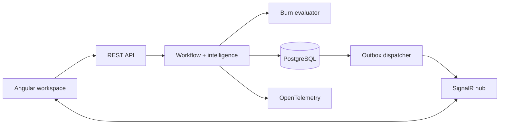
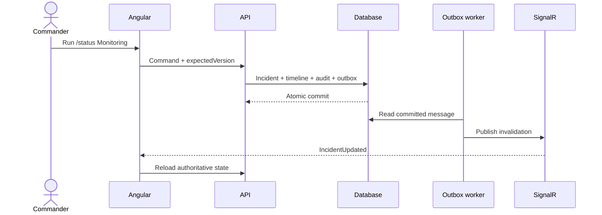

# Architecture

IncidentLens v1.0.0 is a modular monolith with a separately deployable Angular application and ASP.NET Core API. PostgreSQL is authoritative; SignalR accelerates coordination without becoming a second source of truth.

## Boundaries

- `incident-store.ts` owns queue state, the selected incident, mutations, conflicts, and push invalidation.
- `incident-gateway.ts` keeps demo and HTTP transports interchangeable.
- `incident-realtime.ts` owns connection, reconnect, room membership, and presence.
- `IncidentService` owns workflow, filtering, concurrency, idempotency, command parsing, audits, and outbox creation.
- `IncidentHub` owns authenticated rooms; `PresenceTracker` holds ephemeral browser presence only.
- `OutboxDispatcher` publishes committed changes through `IIncidentEventPublisher` and retries failures.
- `AnalyticsService` correlates incident lifecycle timestamps, customer impact, objectives, and health snapshots.
- `PostmortemService` owns learning records, action items, independent versions, and atomic evidence writes.
- `EvidenceExportService` composes incident, audit, and postmortem contracts without exposing entities.
- `IncidentTelemetry` provides custom activities and meters; ASP.NET Core adds HTTP and runtime signals.
- `ReliabilityAutomationService` owns objective versions, maintenance suppression, burn evaluation, signal lifecycle, and transactional incident promotion.

## Operational properties

- REST and SignalR share JWT role policies.
- All mutations atomically increment the incident version and write timeline, audit, and outbox rows.
- Alert keys are uniquely indexed; duplicate deliveries converge on the accepted incident.
- Queue filters and pagination execute in the database. SQLite uses sequence ordering because it cannot order `DateTimeOffset`; PostgreSQL uses `UpdatedAt`.
- Fifteen API integration tests cover authentication, workflow, stale writes, alert replay, outbox creation, commands, paging, SignalR presence, analytics, postmortems, evidence, objectives, burn evaluation, maintenance suppression, acknowledgement, and promotion.

## Known v0.5 boundaries

Presence is process-local; horizontal scaling will require a SignalR backplane and shared presence. The dispatcher does not yet use row leasing. Evaluation is operator-triggered and consumes stored service-health snapshots; scheduled workers and provider-specific telemetry rollups are planned beyond v1.0.

## Tenant isolation (v0.6.0)

The authenticated OIDC/JWT `tenant_id` claim provides the organizational boundary.
`TenantContext` retrieves the validated claim, and `IncidentLensDbContext` filters
all tenant-owned tables at query time and validates ownership before writing.
Legacy rows are explicitly backfilled to `demo` during PostgreSQL migration;
the DB default is then removed. Incident sequence numbers and idempotency keys
are unique per tenant. The background outbox dispatcher reads all pending
tenants deliberately, then enters a narrowly scoped tenant context while
committing changes. Realtime group names include tenant ID, and room admission
queries verify existence for that authenticated tenant. For operations and caveats
see [TENANCY.md](TENANCY.md).

## Data protection (v0.7.0)

Retention is a commander-only, tenant-filtered API with an explicit confirmation
and an operator-enabled gate. It prunes only expired health snapshots and
delivered outbox rows in bounded batches; incident evidence and undelivered
messages remain untouched. Retention periods are server-controlled and can be
overridden per tenant. The PostgreSQL backup is a **database-wide**, sensitive
artifact; refer to `docs/DATA_PROTECTION.md` for verified backup, guarded
restore, and measured disaster-recovery operations.

## Hardening (v0.9.0)

ASP.NET Core authenticates before request admission; the fixed-window limiter
applies tenant-wide quotas to validated tenant claims and connection-IP quotas
to unauthenticated requests. Health probes remain exempt. See
`docs/HARDENING.md` for security boundaries, performance methodology,
request-body limits and failure drills. On PostgreSQL, outbox retrieval
filters due messages *before* batch truncation; SQLite's development-only
path sorts/filter pending rows in memory. Real-time events remain at-least-once.

## Browser sign-in (v1.0.0)

`AuthService` handles the public OIDC authorization-code/PKCE transaction.
Anonymous `/api/auth/client-config` exposes only the issuer, SPA client ID and
scopes. State/PKCE verifier exist briefly in sessionStorage; access tokens
remain solely in memory, and are supplied to same-API-origin HTTP and SignalR.
An expired token or 401 clears the session. The API remains authoritative for
JWT issuer, audience, lifetime, role and tenant validation. See
`docs/AUTHENTICATION.md` for exact identity-provider requirements.
